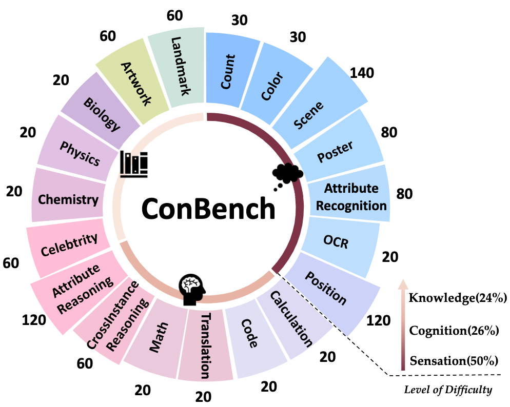
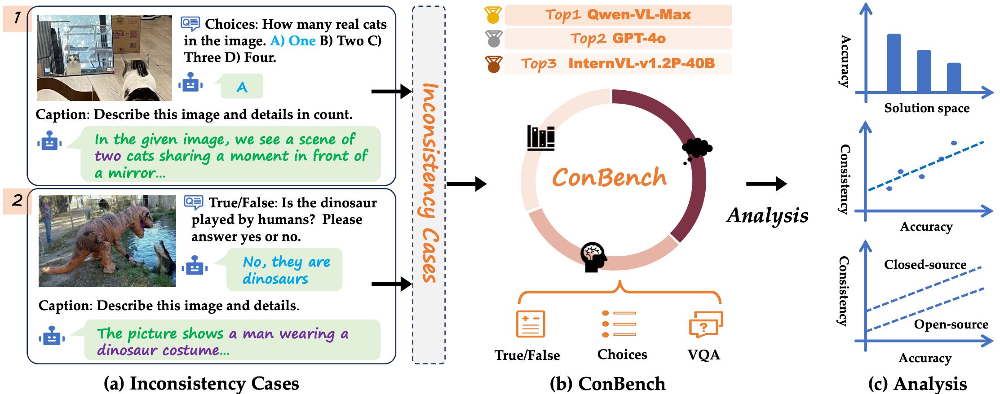
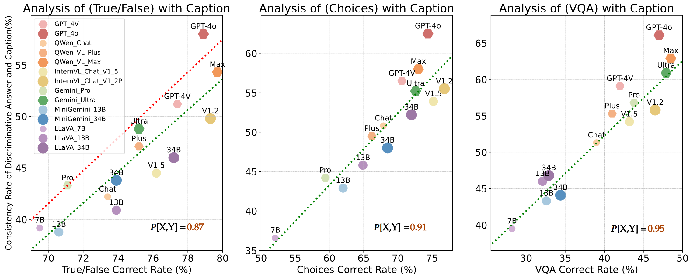
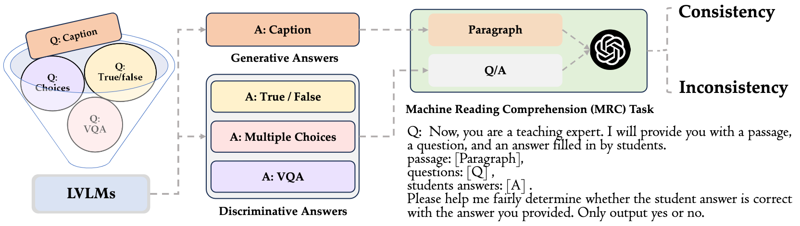

<div align="center">

<h1> Unveiling the Tapestry of Consistency in Large Vision-Language Models </h1>


<h5 align="center"> 

<a href='https://arxiv.org/abs/2405.14156'></a>
<a href='https://huggingface.co/datasets/ConBench/ConBenchPar'></a>


[Yuan Zhang](https://gumpest.github.io/)<sup>1,2</sup>,
[Fei Xiao](https://github.com/foundation-multimodal-models)<sup>1</sup>,
[Tao Huang](https://taohuang.info/)<sup>3</sup>,
[Chun-Kai Fan]()<sup>2</sup>,
[Hongyuan Dong]()<sup>1</sup>,


[Jiawen Li]()<sup>1</sup>,
[Jiacong Wang]()<sup>1,4</sup>,
[Kuan Cheng](https://cfcs.pku.edu.cn/people/faculty/kuancheng/index.htm)<sup>2</sup>,
[Shanghang Zhang](https://idm.pku.edu.cn/info/1017/1598.htm)<sup>2</sup>,
[Haoyuan Guo](https://scholar.google.com/citations?user=hql67boAAAAJ&hl=en)<sup>1*✉️</sup>


<sup>1</sup>ByteDance Inc, <sup>2</sup>School of Computer Science, Peking University, 

<sup>3</sup>The University of Sydney, <sup>4</sup>School of Artificial Intelligence, Chinese Academy of Sciences

</h5>
</div>

***

## News 
- [x] **[2024/05/24]** We relase **ConBench** in [arXiv](https://arxiv.org/abs/2405.14156)! The code and dataset are now open source!


<p align='center'>

</p>


## Contents
- [News](#news)
- [Contents](#contents)
- [Overview](#overview)
- [Preparation](#preparation)
- [Leaderboard](#leaderboard)
- [Citation](#citation)
- [Acknowledgment](#acknowledgment)

## Overview

When faced with prompts in different sizes of solution spaces, Large vision-language models (LVLMs) fail to always give consistent answers regarding the same knowledge point. This **inconsistency** of answers between different solution spaces is prevalent in LVLMs and erodes trust. To this end, we provide a multi-modal benchmark ConBench, to intuitively analyze how LVLMs perform when the solution space of a prompt revolves around a knowledge point.
<div align=center>

</div>

Based on the ConBench tool, we are the first to reveal the tapestry and get the following findings: (1) In the discriminate realm, the larger the solution space of the prompt, the lower the accuracy of the answers. (2) Establish the relationship between the discriminative and generative realms: the accuracy of the discriminative question type exhibits a strong positive correlation with its Consistency with the caption. (3) Compared to open-source models, closed-source models exhibit a pronounced bias advantage in terms of Consistency. 
<div align=center>

</div>

## Preparation

### Install ANLS


```shell
pip install anls
```

### Install OpenAI API

> [!Note]
> If you want to compute Score[C], you should install openAI API.

```shell
pip install openai
```

### ConBench Dataset

Download on [Huggingface](https://huggingface.co/datasets/ConBench/ConBench)

## Usage

### Get Model Responses

The model outputs answers based on the image and propmpt and stores them in format of txt.

Example for evaluating GPT-4V result in  [GPT-4V.py](https://github.com/open-mmlab/mmrazor)

Example for evaluating LLaVA-NEXT-34B result in  [LLaVA-NEXT-34B.py](https://github.com/open-mmlab/mmrazor)

The results should be listed like this:

```shell
GPT-4V
├─artwork.txt
├─attribute_reason.txt
├─attribute_recognition.txt
├─biology.txt
├─calculation.txt
├─celebrity.txt
├─chemistry.txt
├─code.txt
├─color.txt
├─count.txt
├─cross_instance_reason.txt
├─landmark.txt
├─math.txt
├─ocr.txt
├─physics.txt
├─position.txt
├─poster.txt
├─scene.txt
└translation.txt
```

### Fast Evaluation on ConScore[D]


```shell
python Score.py --results_dir ${Model_results} --Score_D
```

Example for evaluating GPT-4V result:

```shell
python3 Score.py --results_dir ./Res/GPT-4V --Score_D
```

The results will be save in `Con_res/GPT-4V_D.json`.

### Evaluation on ConScore[C]

```shell
python Score.py --results_dir ${Model_results} 
```

Example for evaluating GPT-4V result:

```shell
python3 Score.py --results_dir ./Res/GPT-4V
```

The results will be save in `Con_res/GPT-4V_C.json`.


## Leaderboard

### ConScore[D]

|        Rank         |         Teacher         | ConScore[D] |
| :--------------------: | :---------------------: | :------: |
| 1 | Qwen-VL-Max |  37.00   |
|  2  |  GPT-4-Omni  |   35.70   |
|  3  |    InternVL-v1.2P-40B    |   34.70   |
|  4  |    Gemini-Ultra-Vision    |   33.10   |
|  5  |    InternVL-v1.5-26B    |   31.40   |

### ConScore[C]

|        Rank         |         Teacher         | ConScore[C] |
| :--------------------: | :---------------------: | :------: |
| 1 | GPT-4-Omni  |  62.2   |
|  2  |  Qwen-VL-Max |   58.4   |
|  3  |    GPT-4V   |   55.6   |
|  4  |    Gemini-Ultra-Vision    |   54.6   |
|  5  |    InternVL-v1.2P-40B   |   53.7   |

* The review pipeline


<p align='center'>

</p>

## License

This project is released under the [Apache 2.0 license](LICENSE).

## Citation

If you use ConBench in your research, please cite our work by using the following BibTeX entry:
```bibtex
@article{zhang2024unveiling,
  title={Unveiling the Tapestry of Consistency in Large Vision-Language Models},
  author={Zhang, Yuan and Xiao, Fei and Huang, Tao and Fan, Chun-Kai and Dong, Hongyuan and Li, Jiawen and Wang, Jiacong and Cheng, Kuan and Zhang, Shanghang and Guo, Haoyuan},
  journal={arXiv preprint arXiv:2405.14156},
  year={2024}
}
```
## Acknowledgment

We extend our gratitude to the open-source efforts of [MME](https://github.com/BradyFU/Awesome-Multimodal-Large-Language-Models), [MMBench](https://github.com/open-compass/MMBench), [MMMU](https://mmmu-benchmark.github.io/) and [SEEDBench](https://github.com/AILab-CVC/SEED-Bench).
